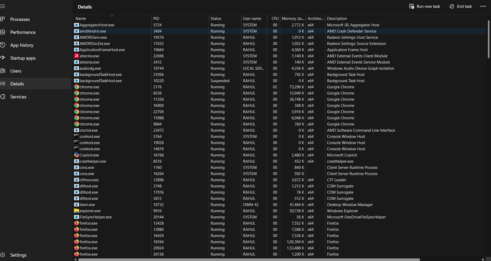
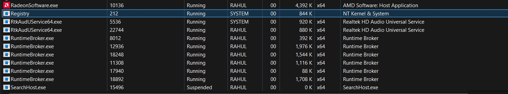
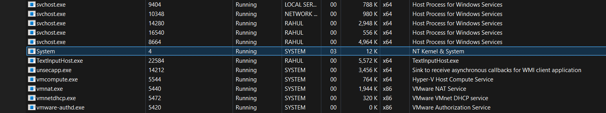
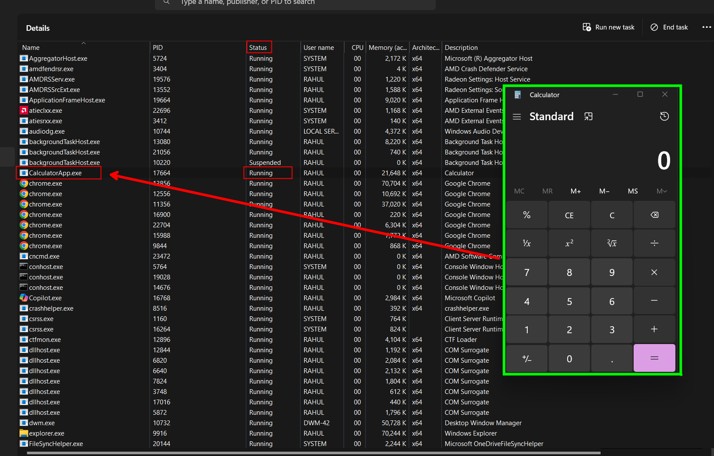
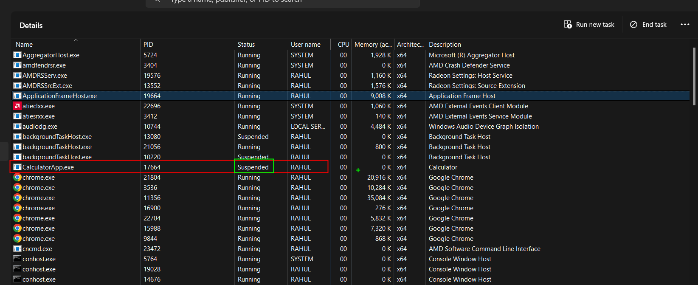
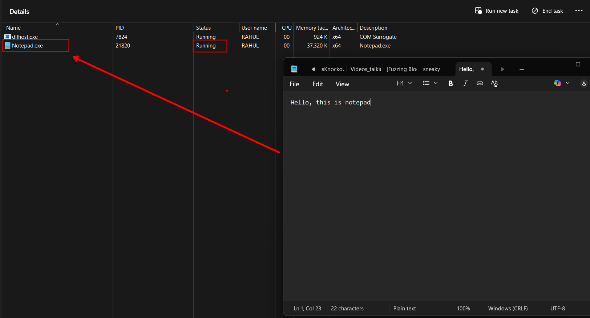

# Task Manager

We can see  multiple instances of the same process, so definetly process name cannot  be used to uniquely identify a process.

process id is used to uniquely identify a process running on the system.

> once the process gets terminated, these process process id can be used by other processes as well

‍

Registry” in the process list represents the kernel component that handles all Registry I/O.

‍

‍

‍

when we started the calculator app, its process started and currently its on the running state.

As we minimize the calculator, its goes to a suspended state. suspended means that all the threads within calculator are suspended, and calculator cannot make any forward progress.  if we go ahead and restore calculator it goes back into the running state.This suspended state is mostly used for application, which are typically downloaded from microsoft store.

‍

If we take something else like notepad, and we can see its currently in the running state.

‍

if we just go ahead and minimize notepad, its still on the running state it doesnt get suspended.

‍

So, this type of suspension only happens to some apps and not all, this behaviour is very similar to the mobile world. If you have your mobile device and you launch an application the previous application go to the baground, that application is going to be suspended by the operating system, so that it doesnt consume any cpu time.

‍

Apart from the running and suspended state of processes, we have a 3rd stage as well.

> **NOT RESPONDING**

Not responding is  the case where a process seems to be unresponsive, it has window may be more than one window, those windows seem to be unresponsive, you will see not responding being written on the title bar by windows, this happens when the thread managing the ui for that process

 doesnt check its message queue for atleast 5 seconds, this is where windows concludes this is a not responding process. but really its about the thread, task manager is kind of limited and do not provide verbose output.

One of the two things happen either the thread is crazily burning cpu cycles and doesnt get a chance to examine its ui message for atleast 5 seconds, or the thread made some kind of call such as an i/o or networking operation and the results take  more than 5 seconds to return, obviously nobody likes it insome cases the process will get aroun to continuing if the result is retrieved back after a while, but insome cases they probably want and we typically go to the end task button to forcefully terminate the process.
