# Threads

A thread is an entity that is scheduled by the kernel to execute code. It represents a sequence of instructions that the CPU can execute, and multiple threads can exist within a single process,

‍


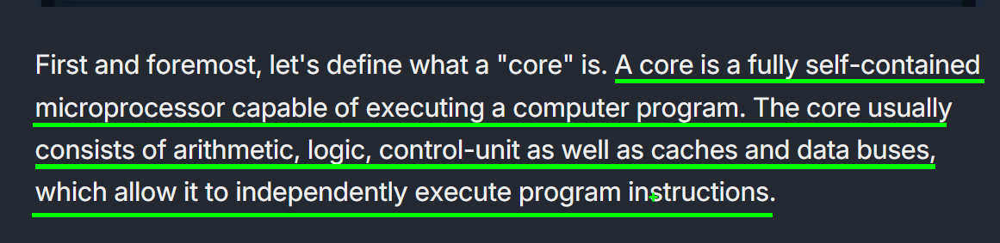

 [Reference](https://www.techspot.com/article/2363-multi-core-cpu/)

>  *If we want a process to be able to execute on multiple CPUs at a time,  to take advantage of the multi-core systems, the process must have  several execution-context called threads.*

A thread is an active entity which executes a part of a process. Multiple threads execute simultaneously with each other which results in the execution of a single whole process.

<span data-type="text" style="color: var(--b3-font-color10);">with 8 cores, a processor can generally execute up to 8 threads concurrently</span>, but some processors may have [hyperthreading](https://www.google.com/search?client=firefox-b-d&cs=1&sca_esv=571e9f62cdadf4fd&q=hyperthreading&sa=X&ved=2ahUKEwjCzqCrgtCOAxXm1jgGHaLKMwgQxccNegQIBBAC&mstk=AUtExfDJQQwH264BTAb_tMhbfc37UCsCHuSPS6fd2ELbMPm1zKbyDofj736HO3a68HZ3Vtn4dnYpCdMvwYTHEb3j1KZkIXHBjh9qaUBiYoYkpUnLdQ_BHz3CmibMZrm1RE0oLP04HOD-OcVsVQNnnY3DvGoduPeG50WDC0HHzN43DLDjAnwRRFItZkVbXgK_JN6VxIIB&csui=3) or [SMT](https://www.google.com/search?client=firefox-b-d&cs=1&sca_esv=571e9f62cdadf4fd&q=SMT&sa=X&ved=2ahUKEwjCzqCrgtCOAxXm1jgGHaLKMwgQxccNegQIBBAD&mstk=AUtExfDJQQwH264BTAb_tMhbfc37UCsCHuSPS6fd2ELbMPm1zKbyDofj736HO3a68HZ3Vtn4dnYpCdMvwYTHEb3j1KZkIXHBjh9qaUBiYoYkpUnLdQ_BHz3CmibMZrm1RE0oLP04HOD-OcVsVQNnnY3DvGoduPeG50WDC0HHzN43DLDjAnwRRFItZkVbXgK_JN6VxIIB&csui=3) (Simultaneous Multi-Threading) capabilities that allow each core to handle more than one thread at a time.

‍

when a thread gets created its assumed to be a worker thread, now whats a worker thread? it is supposed to be doing some calculation maybe some i/o some network activity, however if a thread creates some user interface such as calling the create window api, then it becomes the user interface thread and for that case it gets a message queue, its going to be a place where messages are going to land that have something to do with the windows created by the thread, so if the thread is not examining its message queue often then we might get to that not responding state.

‍

‍

**What Is a Process?**   
A **process** is an executing program. The operating system uses processes to keep different applications separate.

```pgsql
+--------------------------+
|    Process A (App 1)     |
|  - Code                  |
|  - Data                  |
|  - Virtual Address Space |
+--------------------------+

+--------------------------+
|    Process B (App 2)     |
|  - Code                  |
|  - Data                  |
|  - Virtual Address Space |
+--------------------------+

```

A process on its own is a container for the program's code, data, and  resources, but it needs an active component to execute instructions on  the CPU. That active component is called a thread. We can think of thread as separate path of execution, it is an entity that is scheduled by the kernel to execute code.

‍

**A thread maintains:** 

**The state of cpu registers:**  Everytime a context switch occurs a thread is being removed from the processor, to make room for another thread, the state of the cpu register for the thread needs to be saved, so the next time that thread gets cpu time may be on the different processor the state can be restored and continue running from exactly the same spot it left off.

There are bunch of properties that are part of the scheduling state.

‍

## Thread state: 

Every thread must save a small “snapshot” of where it is and how it’s running, so it can stop and later pick up exactly where it left off. Important pieces of that snapshot (the **thread context**) are:

1. **CPU Registers &amp; Program Counter**

    - These hold the exact instruction address (program counter) and temporary data (registers) the thread is using right now.
2. **Stack Pointer**

    - Points to the thread’s call stack where it keeps track of function calls, local variables, return addresses, etc.
3. **Execution Mode**

    - Tells the CPU whether this thread is running in **user mode** (normal application work) or **kernel mode** (inside OS code).

```pgsql
Thread Context:
+-------------------------+
| ...                     |
| Mode Bit = 0  ← User    |
| Mode Bit = 1  ← Kernel  |
| ...                     |
+-------------------------+
```

4. **Priority**

- A number (say 0–31) that says how “urgent” this thread is. Higher‐priority threads get CPU time before lower‐priority ones.

1. **Current State**

    - One of **Ready**, **Running**, or **Waiting** so the scheduler knows whether it can dispatch this thread onto the CPU right now

‍

**The common three states are:**   
**Ready**: Ready to execute (but currently all processors are unavailable)  
**Waiting**: The thread doesnt want to run right now it is waiting for something  
**Running**: Currently executing code onto the processor

‍

‍

**TLS (Thread Local Storage)** 

Thread Local storage is a mechanism for windows applications to execute code which is thread specific and the interesting thing is that it executes before the main function.

‍

Lets take a classic example of where this thing is useful

```pgsql
void f() {
    FILE* fp = fopen("myfile.txt", "rb");
    if(fp == NULL) {
        switch(errno) {
            case ... :
                // case ...
                break;
        }
    }
}

void g() {
    FILE* fp = fopen("myfile2.txt", "rb");
    if(fp == NULL) {
        switch(errno) {
            case ... :
                // case ...
                break;
        }
    }
}

```

‍

When the C runtime was designed back in ​**1971**​, there was no concept of multithreading as we know it today. At that time, having **​`errno`​**​ **as a global variable** was perfectly fine because programs typically ran in a single thread of execution.

However, in a modern multithreaded environment, keeping `errno` as a true global variable would cause serious issues.

Imagine two functions, **f** and ​**g**​, running at the same time in ​**two different threads**:

- Function **f** opens a file and encounters an error. It sets `errno` to indicate what went wrong.
- At almost the same time, function **g** opens another file (`file2.txt`​). It may succeed or fail with a different error, which would update `errno` again.

This means that by the time function **f** checks `errno`​ to determine its own error, the value may have been ​**overwritten by function g**​, leading to incorrect error reporting.  
In the classic C runtime, there was **no solution** because all threads shared the same global memory.

Today, this problem is solved using ​**Thread Local Storage (TLS)** ​.  
TLS allows **each thread** to have its own separate copy of certain data.

Modern C runtimes implement `errno`​ not as a true global variable but as a **macro** that resolves to a ​**thread-local value**​.  
So even though we access `errno`​ uniformly in code, each thread actually reads and writes to **its own private instance** stored in TLS.

This ensures that error states remain ​**isolated per thread**, eliminating the race condition that existed in older C runtimes

‍

‍

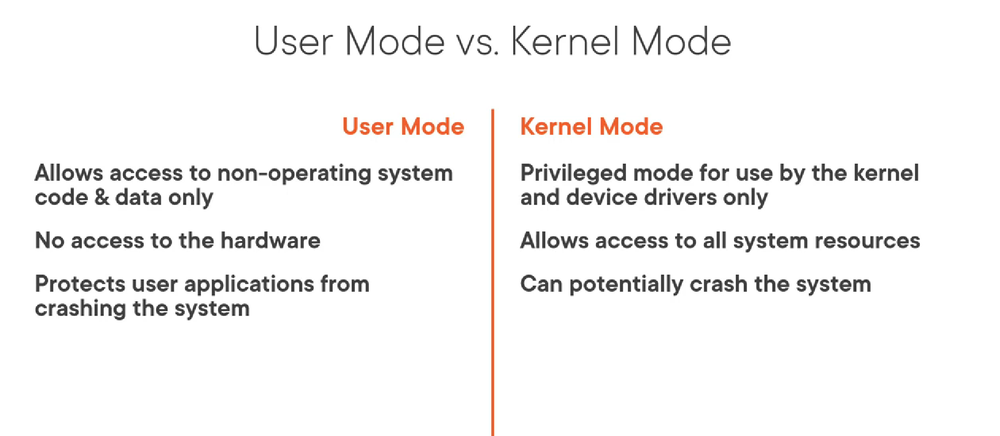

‍

The Performance Tab of Task Manager shows

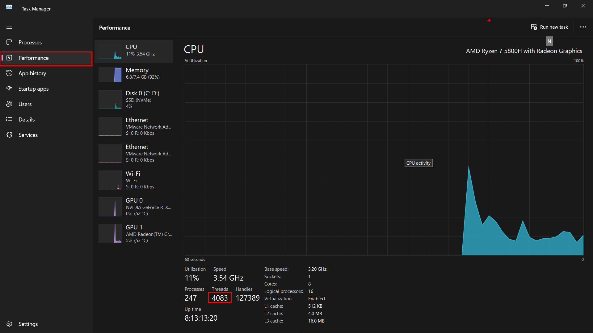

There are 4083 threads in our system right now. Logical Processors Applies to Host machine (your real system)

||
| --|

‍

Right click > Show the graph to Logical processors

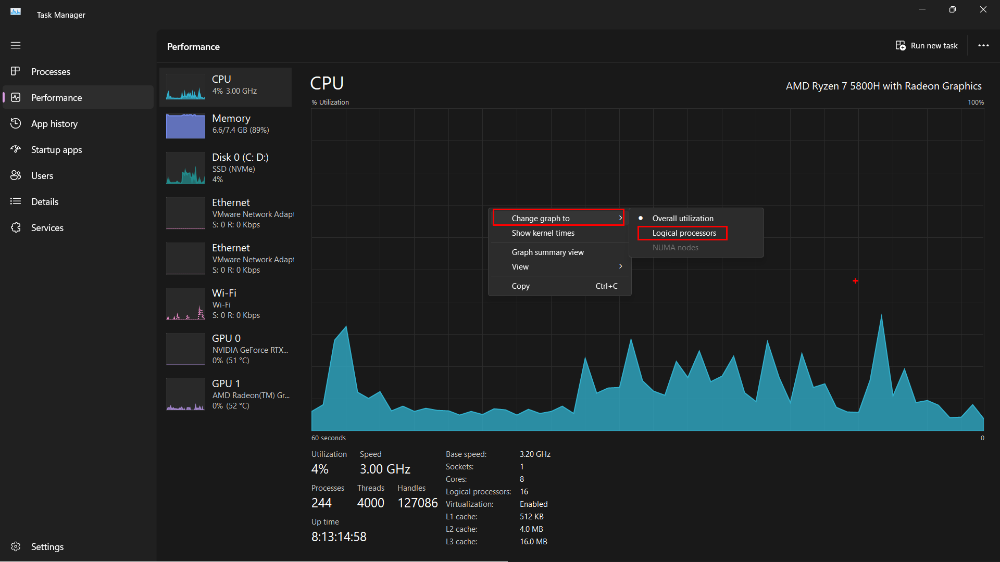

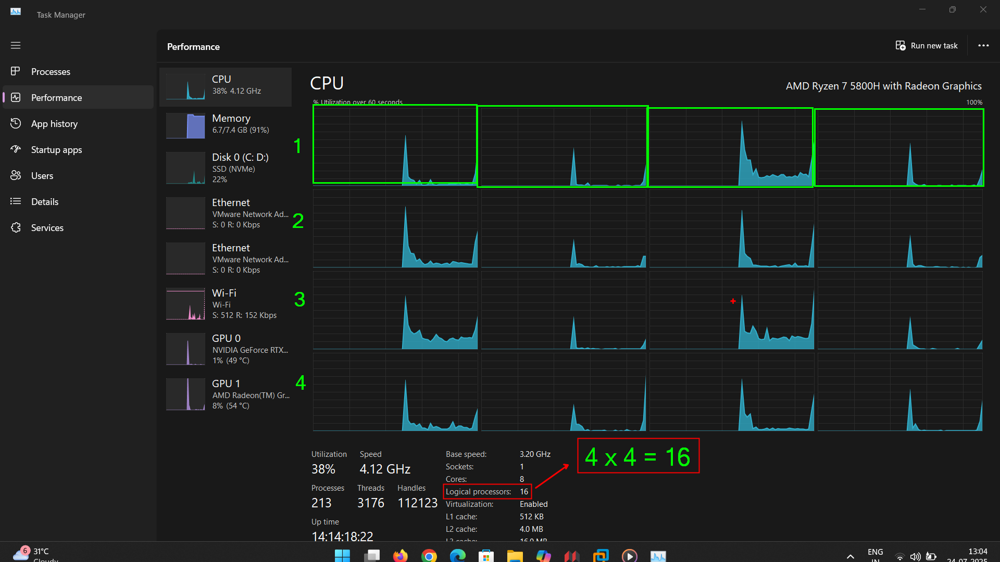

‍

‍

If i do the same thing on my virtual machine i get

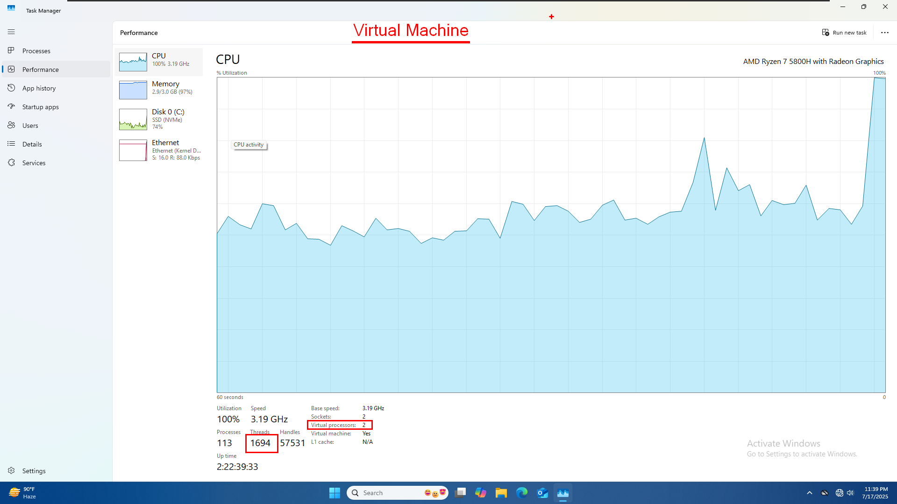

Virtual Processors applies to  **Guest machine (inside a VM).**  so in this virtual machine there are 2 virtual processors, this means that at any given  point in time 2 threads at most will be on the running state , if there are more threads that wants to run then some will run and others will be in the ready state they want to execute code but they cant do that right now.

‍

Notice that in this virtual machine there are 1694 threads its a small number compared to the host system, but the cpu utilisation is 100% since we have only 2 processors atleast 2 threads are running so we are at a 100% utilisation.

‍

**We can see the details about threads  in task manager**


‍

‍

Inside process explorer we get more details , currently there are 94 threads in the explorer process This view is updated dynamically every second to show us anykind of change.

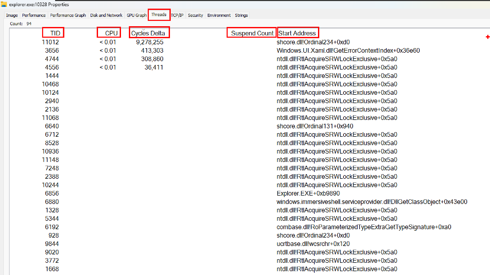

‍

**TID:**  Similar to PID , we identify a thread uniquely by its thread id.

- The OS keeps one common pool of numbers for both PIDs and TIDs.
- Whenever you create a process or a thread, you grab the next free number from this pool.
- That way, a live process and a live thread never end up with the same number.

‍

CPU: cpu consumption

**cycles delta:** 

- Every CPU core runs at a certain clock speed (cycles per second).
- When a thread runs, it “consumes” some of those cycles.
- At each Process Explorer update, it notes how many cycles each thread used so far, then on the next update it subtracts the old count from the new count, that difference is the Delta.

‍

Suspend count: which is normally going to be zero, zero means these threads are not suspended.

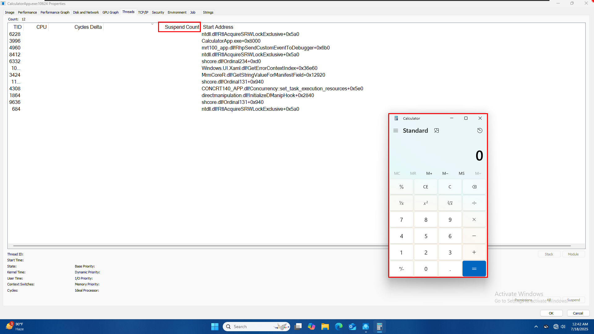

‍

<span data-type="text" style="font-size: 17px;">if we minimize calculator app it goes on the suspended state. and suspend count is now 1 because all the threads has been suspended.</span>

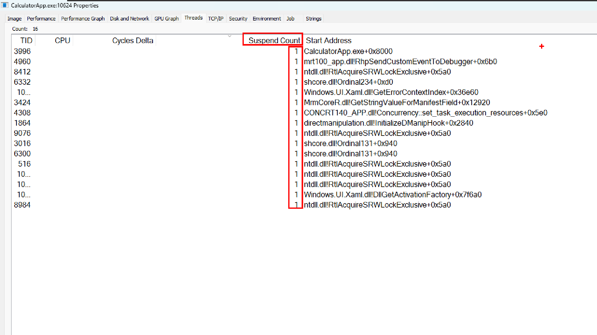

‍

‍

Most of the function names shown here, are not correct, because we can notice the big offfsets, the big offsets indicates, that process explorer doesnt really know what function that is, Because symbols are not properly configured.

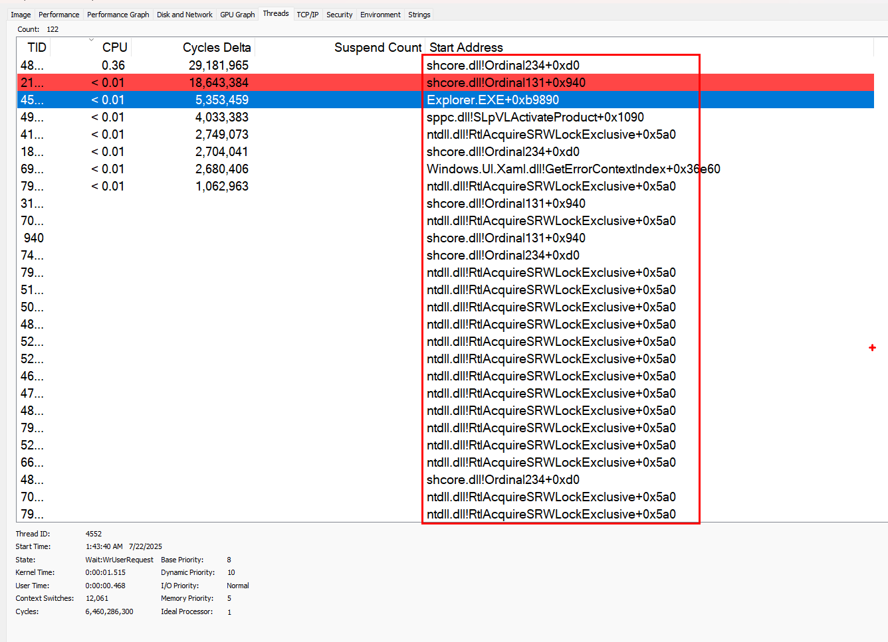

- **PDB (Program Database) files:**  These are special files generated during the compilation process (In Microsoft environments). They contain a wealth of symbolic information:

  - Which memory addresses correspond to which function names.
  - Which memory addresses correspond to which variable names.
  - Line numbers in your original source code,Data types, etc.
- The PDB file acts like a detailed map or directory. When the debugger has access to the PDB file for the DLL, it can precisely look up any address like `0x70001000`​ (or the closest starting address of a function, like `0x70000560`​, which means the function starts slightly before where you are currently executing) and tell you, "Ah, that's the `MyImportantFunction`!" It might even tell you something like "MyImportantFunction + 0x1A" if you're 26 bytes into the function. This is incredibly helpful for understanding what your program is doing.

‍

Imagine you've built a toolbox (your DLL) with various specialized tools (functions) inside it. You want to share this toolbox with other people (other programs) so they can use your tools.

### What are "Exported Entries"?

Before other programs can use the tools in your toolbox, you have to tell them which tools are available and how to find them. This process is called **exporting**. When a DLL is created, the developer explicitly marks certain functions as "exported." These are the functions that the DLL intends to make publicly available for other programs to call.

‍

‍

Start Address:  it is suppose to give us a hint to the start address of that thread

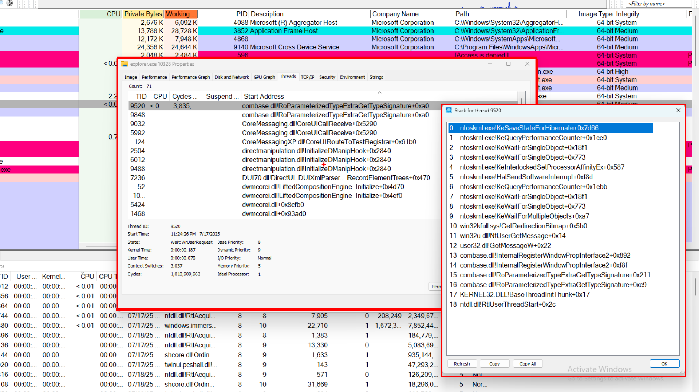

‍

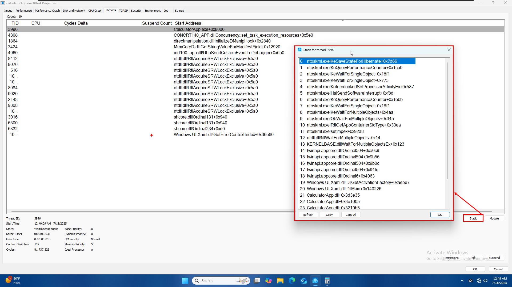

When you **Double click a thread** or click the **Stack** button in its Properties.

- Process Explorer grabs a snapshot of that thread’s execution point **right now**.
- It then walks up through:

  1. **User mode stack** (all the functions your application code has called)
  2. **Kernel mode stack** (all the OS/kernel functions handling that thread)

‍

> **User‑mode stack** lives in your process’s own memory. Any tool with read access can walk it.
>
> **Kernel‑mode stack** lives in protected memory inside the OS. You normally cannot read it from user‑level code.

## <span data-type="text" style="font-size: 20px;">The Role of Admin Privileges &amp; the Kernel Driver</span>

- Process Explorer installs a tiny **kernel mode driver** when you run it as Administrator.
- That driver acts as a bridge letting Process Explorer request and read kernel stack frames.
- If you run Process Explorer **without** admin rights, the driver won’t load, so you only get the usermode stack.

‍

‍

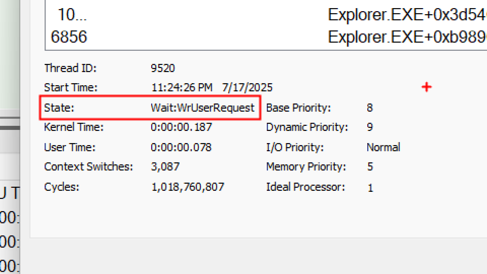

This thread is currently at a waiting state with a waiting reason(which indicates the general reason as why the thread is in a waiting state)  as WrUserRequest, this is just a hint and not really documented but kernel components , but kenrel components that put a thread into a waiting state can decide to give some kind of wait reason which process explorer is showing.

‍


We can see the kernel time and user time, indicates that thread has spend sometime running on kernel mode and user mode.

‍

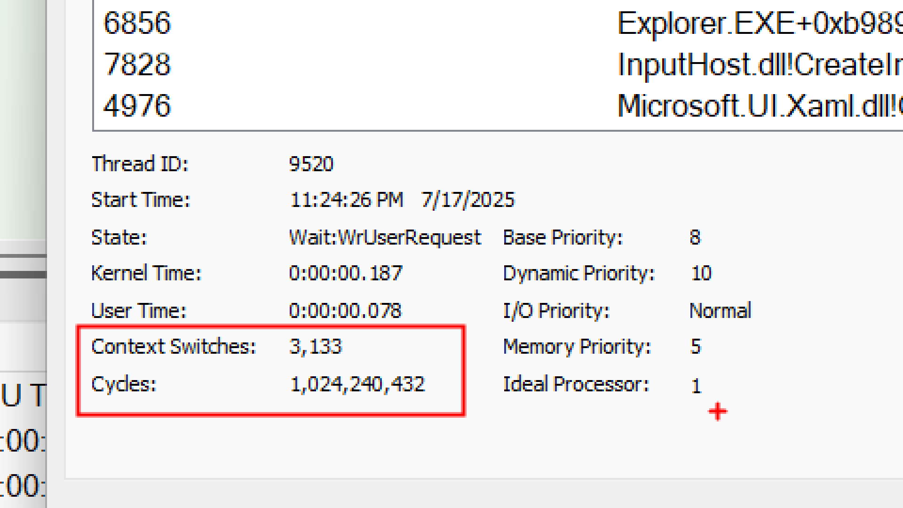

we have the number of context switches this thread has occured since it started\, the total number of cpu cycles it has used for actual execution.

And then you have some information about its priority, there are two values for priority:

**Base Priority**: Default priority which the developer has set  
**Dynamic Priority**: current priority of the thread, which is sometimes temporarily higher than the base priority, because of various algorithm which we will discuss later on.

‍

When threads die,  it is highlighted in red color, and in green color if theres new thread

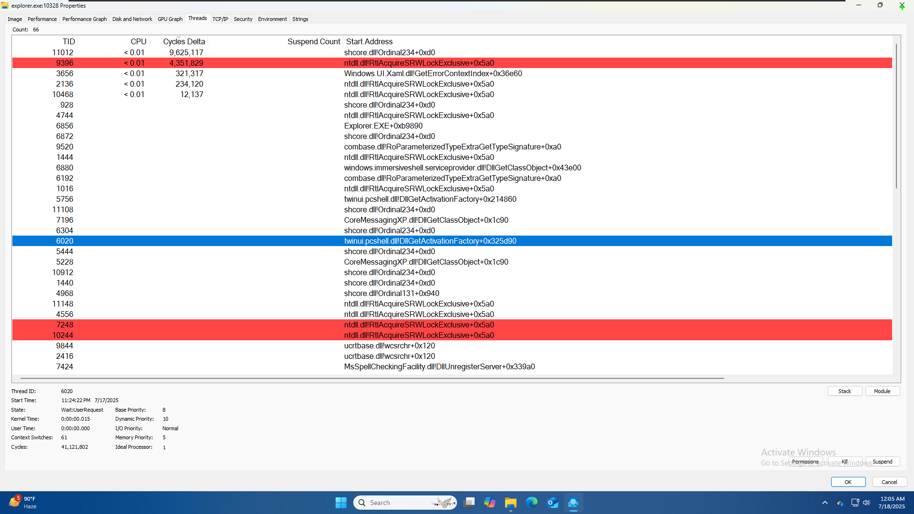

‍

<span data-type="text" style="font-size: 20px;">Lets configure symbols to get better detail in the threads view</span>

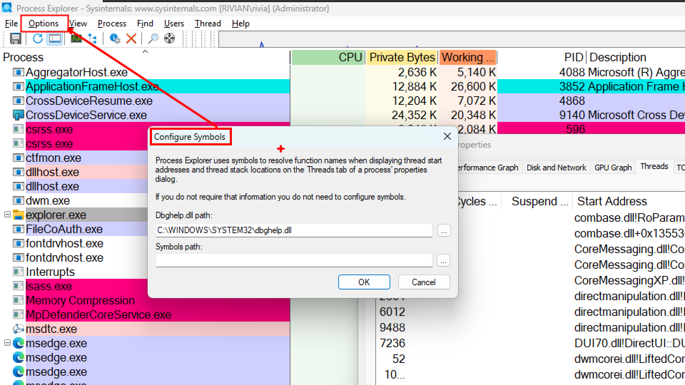

“Symbols” are human readable names (like function names, variable names, source file/line info) that match up with the raw memory addresses in a program.

‍

**Navigate to :** 

```pgsql
C:\Program Files (x86)\Windows Kits\10\Debuggers\x64\dbghelp.dll
```

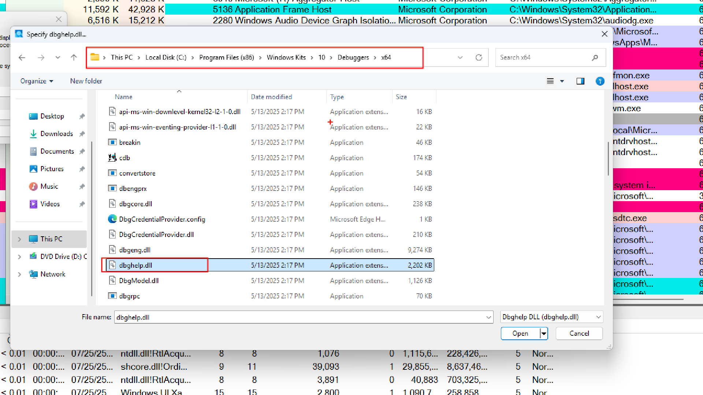

‍

**symsrv.dll** is a file associated with the Windows debugging tools and symbol server, used for resolving memory addresses to function names and other symbolic information during debugging.

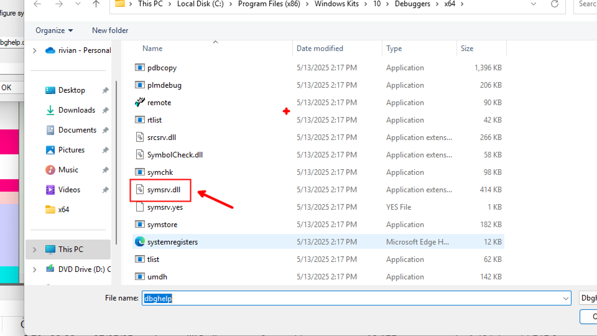

‍

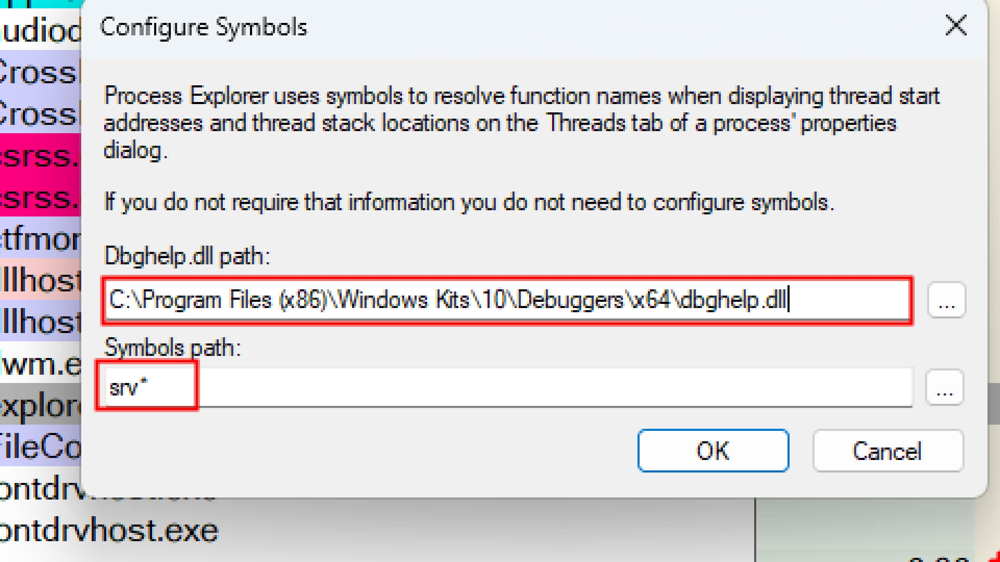

The symbol server enables the debuggers to automatically retrieve the  correct symbol files without product names, releases, or build numbers. Debugging Tools for Windows contains the SymSrv symbol server.

‍

​**​`srv*`​** ​<span data-type="text" style="font-size: 20px;"> </span><span data-type="text" style="font-size: 17px;">is a special prefix that tells :</span>

> “Use the Symbol Server protocol to find and download PDB files.”
>
> Any PDB downloaded from a server will be saved here for future use.

‍

just writing `srv*` is enough to turn on the Symbol Server protocol and by convention it then fills in the “missing” pieces with sensible defaults:

1. **Default Remote Server**  **=**  **Microsoft’s public symbol server**

    if you don’t explicitly give it a URL, SymSrv.dll assumes

```pgsql
https://msdl.microsoft.com/download/symbols
```

So `srv*` alone still points at Microsoft’s PDB repository.

‍

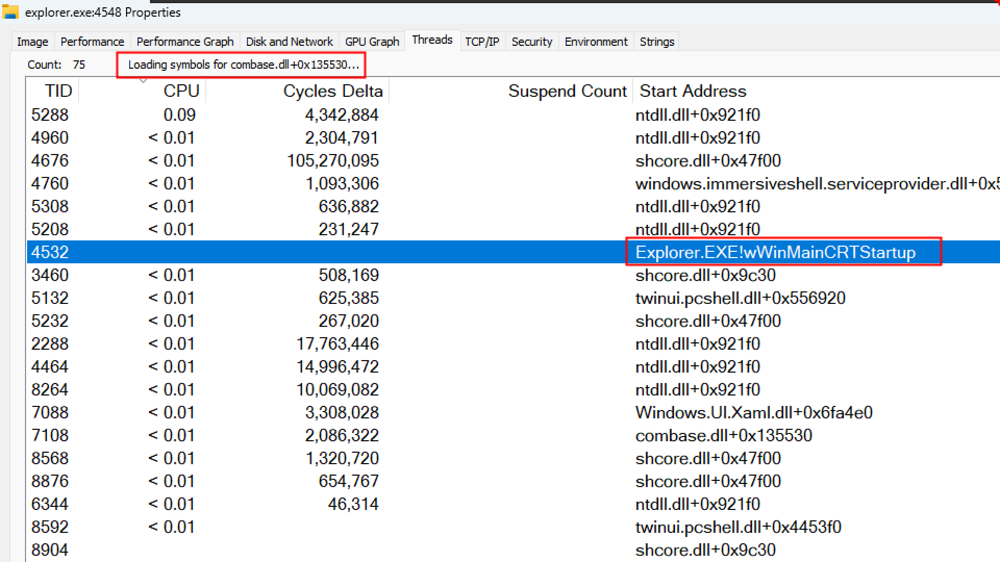

If the symbols are resolved, you'll see the actual function name as follows.**Explorer.EXE!wWinMainCRTStartup**

‍

The call srtack shown for the thread , notice the call stack, the top of the stack is at the top and the bottom of the stack is at the bottom, every usermode thread starts in this function called rtl userthreadstart in nt.dll, thats going to call another funcftion that is used by all threads which is called basethreadinThunk, which is in the in kernel32.dll and then there is call to a function from teh c runtime that bootstraps these code in main thread of explorer thats going to call the real main function of explorer. and somewhere within this main function theres a message loop that is being used by explorer because this is the the thread that has to manage user interface

‍

‍

‍

## But Why not the Windows built‑in dbghelp.dll?

- The one sitting in **C:\Windows\System32\dbghelp.dll** is a **basic** version.
- It can load symbol files (`.pdb`​) if you already have them locally, but it **can’t** speak the Microsoft symbol server protocol over HTTP.

‍

## <span data-type="text" style="font-size: 17px;">Which dbghelp.dll to use?</span>

- Windows includes a basic `dbghelp.dll`​ in `C:\Windows\System32`.

  - Good for **local** PDB lookups, but **cannot** fetch from HTTP.
- The SDK Debuggers folder has a more powerful `dbghelp.dll`​ **plus** `symsrv.dll`.

  - This pair lets you both resolve local PDBs **and** download new ones from a symbol server.

‍


‍

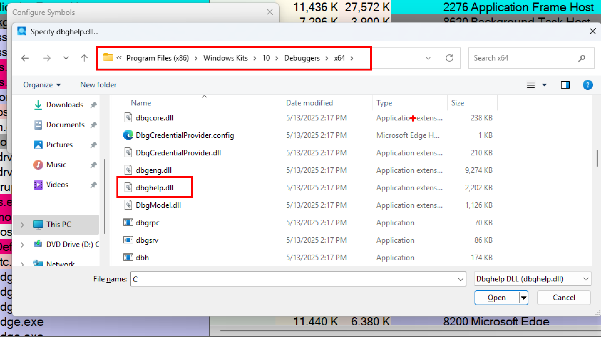

When you install the **Windows 10 SDK** (or the standalone Debugging Tools for Windows), you get `dbghelp.dll`​​ and `symsrv.dll`​ which is under:

```pgsql
C:\Program Files (x86)\Windows Kits\10\Debuggers\x64
```

It’s a Microsoft library (DLL) that provides functions for symbol handling and stack tracing.

‍

**Without Symbols**

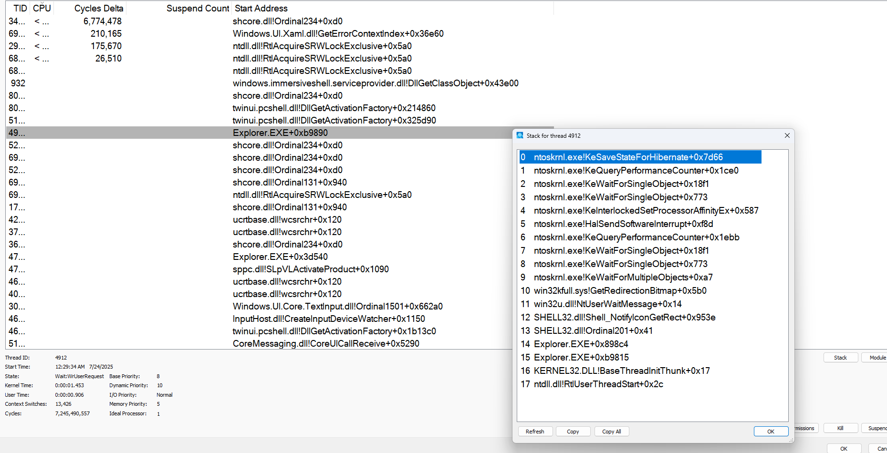

‍

**Start Address** shows things like:<span data-type="text" style="color: var(--b3-font-color10);"> </span>**shcore.dll!Ordinal234+0xd0**

**Call stack** frames are just raw, module+offset or addresses, e.g.:

<span data-type="text" style="color: var(--b3-font-color10);">ntoskrnl.exe+0x1a2b3</span>

‍

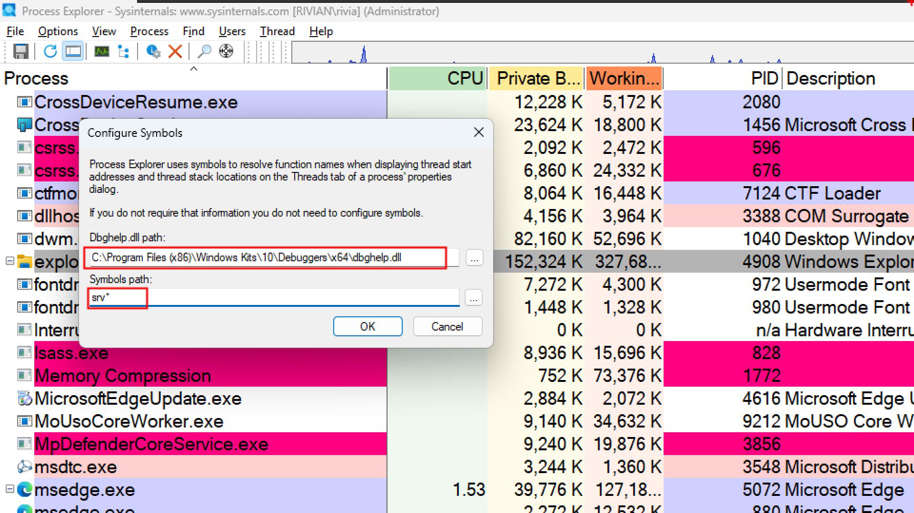

‍

## What is a Symbol Server?

- A **Symbol Server** is simply a network‑accessible repository of `.pdb`​ files.
- Instead of manually downloading and placing PDBs on your machine, tools like Process Explorer can automatically fetch them from the server.
- Microsoft publishes one at `https://msdl.microsoft.com/download/symbols`​, hosting PDBs for all the Windows OS DLLs and common components.

‍

## How do we talk to the Symbol Server?

The HTTP protocol and file layout on Microsoft’s server follow a specific pattern (GUIDs, checksums, folder structure).

- You need a bit of code that knows:

  1. How to form the right URL for a given module + timestamp + checksum.
  2. How to download it over HTTP.
  3. How to cache it locally.

## symsrv.dll

- **cmsrv.dll** is the client side library that implements that HTTP “symbol server protocol.”
- It ships as part of the **Debugging Tools for Windows** (or Windows SDK Debuggers).
- Without it, you have no code path to speak to `msdl.microsoft.com`; you can only load symbols you already have on disk

‍

​**​`srv*`​** ​ tells `dbghelp`​ “use the symbol‑server protocol” i.e. load up `symsrv.dll` and do HTTP.

‍

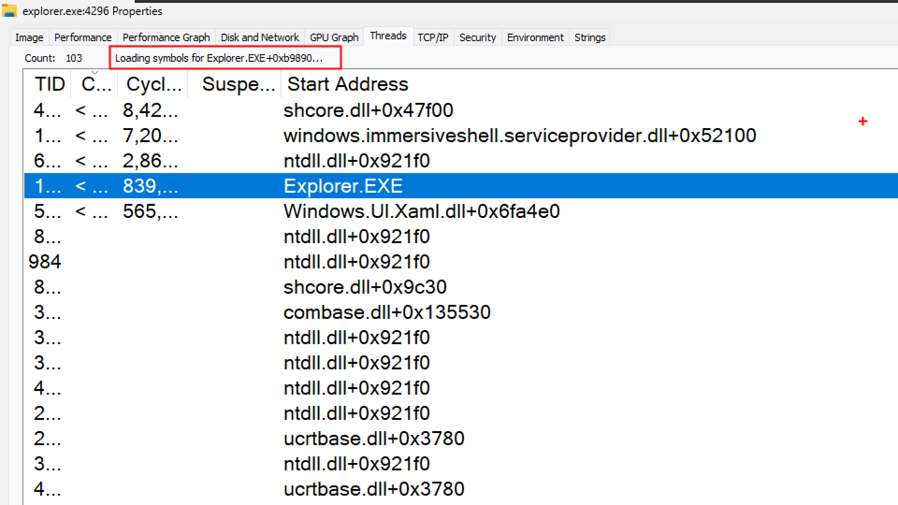

With the SDK’s dbghelp + symsrv + `srv*` path, Process explorer fetches and loads symbols on demand and tells you it’s doing so with that “Loading symbols…” message

‍

‍

For the symbols path we will write srv*

```pgsql
+-------------------+
|  Process Explorer |
+-------------------+
          |
          v
+---------------------------+
| Load dbghelp.dll (SDK)    |
| (with symsrv.dll present)  |
+---------------------------+
          |
          v
+---------------------------+
| Read “Symbols path” entry |
+---------------------------+
          |
          v
+--------------------+    no    +------------------+
| Path starts with   |─────────▶| Local-only lookup|
| “srv*”?            |          +------------------+
+--------------------+
      | yes
      v
+-------------------------+
| Split “srv*” into:      |
|  • Local cache folder   |
|  • Symbol server URL    |
+-------------------------+
          |
          v
+-------------------------+
| cmsrv.dll:              |
|  • Build HTTP URL       |
|    (msdl.microsoft.com) |
|  • Download PDB to      |
|    Local cache folder   |
+-------------------------+
          |
          v
+---------------------------+
| dbghelp.dll loads PDB(s)  |
+---------------------------+
          |
          v
+---------------------------+
| Resolve addresses &       |
| ordinals → function names |
+---------------------------+
          |
          v
+-------------------+
| Display in UI:    |
| • Thread Start    |
|   Addresses       |
| • Stack Frames    |
+-------------------+

```
